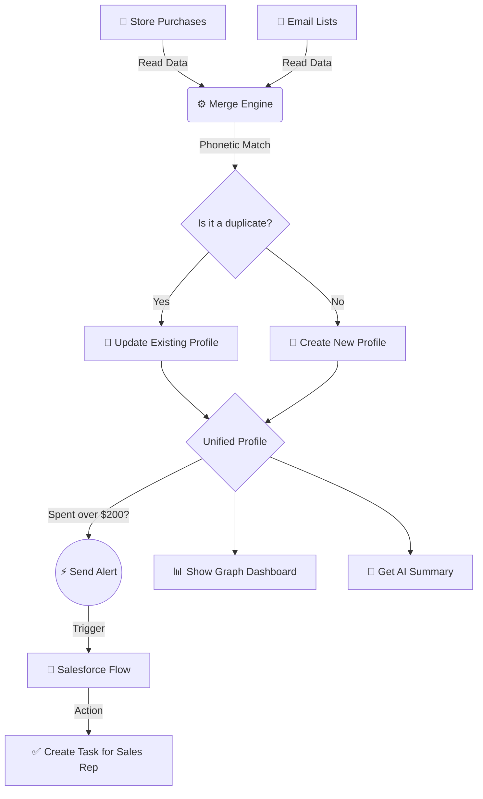

# ☁️ Data Cloud Harmonizer


**A Salesforce app that cleans, merges, and unifies your customer data.**

This project acts like a mini version of Salesforce Data Cloud. It takes customer records from different places (like store purchases and email lists), finds the duplicates even if their names are spelled differently, and merges them into one single "Golden Record". 

---

## 📐 How It Works



---

## 🚀 Main Features

| Feature | Description | Tech Used |
| :--- | :--- | :--- |
| **Smart Merging** | Uses a phonetic algorithm to match names even if they are spelled wrong (e.g., matching "Kathryn" with "Catherine"). | `Batch Apex` |
| **Human-in-the-Loop Resolution** | Provides a specialized "Inbox Zero" manual queue for edge-case duplicates that fall below the fuzzy matching threshold, ensuring strict data governance. | `LWC`, `SLDS` |
| **Visual Dashboard** | A custom screen that draws a graph showing exactly which old records merged to create the new profile. | `LWC`, `D3.js` |
| **Agentforce Insights** | Provides a **simulated** AI paragraph evaluating customer value. (Built to demonstrate frontend-backend integration without incurring active API costs). | `Apex`, `LWC` |
| **Automatic Tasks**| If a merged customer has spent more than $200 in total, the system instantly assigns a Task to a sales rep to call them. | `Platform Events`, `Flow` |
| **Secure API** | A safe way for outside systems (like a website) to read the merged customer profiles. | `Apex REST` |
| **Automated Testing** | Comprehensive Apex test coverage ensuring the batch merge logic handles large data volumes securely. | `Apex Testing` |

---

## 🏗️ How to Scale for Millions of Records

If you want to use this architecture for a massive enterprise company, here is how you would upgrade it:

*   **Real-Time Updates (CDC):** Instead of running the merge engine once a day, use **Change Data Capture** to update profiles the exact second new data is saved.
*   **Database Indexing for LDV:** To prevent SOQL timeouts on Large Data Volumes, you must request **Custom Indexes** from Salesforce Support on the fuzzy matching key fields.
*   **Dynamic Object Mapping:** Hardcoding field mappings in Apex is an anti-pattern. Mappings should be moved to **Custom Metadata Types (CMDT)** so Admins can configure new data sources declaratively.
*   **Fast Uploads:** Use **Bulk API 2.0** when uploading millions of rows of data so the system doesn't slow down.
*   **Stronger Security:** Use **JWT Bearer Tokens** instead of standard passwords to keep the API completely secure from hackers.

---

## 🎯 Who is this for?

This tool helps different teams by giving them one clean list of customers:

*   **📈 Sales Teams:** Find hidden VIP customers. Sometimes a customer looks like a small buyer, but when you merge their 3 duplicate accounts together, you realize they are a huge spender. The system automatically creates a Task to call these VIPs.
*   **🎯 Marketing Teams:** Stop sending the same email to the same person 3 times. Build a clean, deduplicated mailing list.
*   **🎧 Customer Support:** When a customer calls, see their entire history (both online and in-store) on one single screen.

---

## 🔌 How to Use With Your Real Data

This project comes with fake data so you can test it immediately. But you can easily change it to work with your real Salesforce data. *(Note: For a production deployment, replace this manual Apex configuration with Custom Metadata Types).*

1. **Change the Data Source:** Open `IdentityResolutionEngine.cls` and change the code to look at your real `Contact` or `Lead` records instead of our fake data.
2. **Pick the Fields:** Tell the code which fields you want to use for matching (for example, use `Contact.FirstName` and `Contact.Email`).
3. **Automate It:** Set the code to run automatically every night so your database stays clean while you sleep.

---

## 🛠️ Quick Start

1. Authenticate your Salesforce CLI to your org:
   ```bash
   sf org login web
   ```
2. Push the code to your Salesforce org:
   ```bash
   sf project deploy start --source-dir force-app
   ```
3. Give yourself the **Data Cloud Harmonizer** Permission Set.
4. Open the **Data Cloud Explorer** app in Salesforce.
5. Click **Inject Mock Data**, then click **Run Harmonization** to watch it work!
