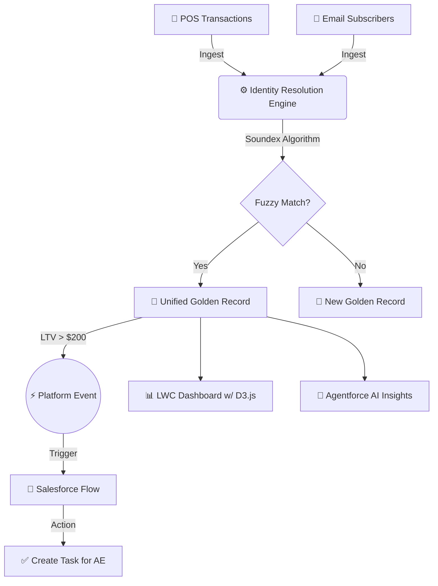

# ☁️ Data Cloud Harmonizer


**An enterprise-grade Identity Resolution engine and Data Cloud simulation built natively on Salesforce.**

This project unifies disparate data sources, performs complex identity resolution using fuzzy matching algorithms, visualizes data lineage, and triggers real-time event-driven automations.

---

## 📐 Architecture Flow



---

## 🚀 Core Capabilities

| Feature | Description | Tech Stack |
| :--- | :--- | :--- |
| **Fuzzy Matching** | Uses the **Soundex algorithm** in Apex to resolve spelling variations across data sources (e.g., "Kathryn" -> "Catherine"). | `Batch Apex` |
| **Data Lineage UI** | A premium custom dashboard using **D3.js** to visually map how disparate records merge into a single Unified Profile. | `LWC`, `D3.js` |
| **AI Insights** | Provides generative AI summaries evaluating customer value and match confidence scores. | `Apex`, `LWC` |
| **Event-Driven Actions**| Fires `High_Value_Unified__e` Platform Events when a profile exceeds $200 LTV, instantly triggering follow-up Tasks. | `Platform Events`, `Flow` |
| **Secure REST API** | A bulkified endpoint (`/v1/UnifiedProfile/`) for external querying, strictly enforcing Field-Level Security. | `Apex REST`, `WITH USER_MODE` |

---

## 🏗️ Enterprise Scalability Considerations

To scale this architecture to **millions of records** in a production environment, the following enterprise patterns should be adopted:

*   [x] **Change Data Capture (CDC):** Transition from scheduled batch processing to real-time harmonization. Enable CDC on source objects and use Queueable Apex for near real-time fuzzy matching.
*   [x] **High-Volume Ingestion:** Utilize **Bulk API 2.0** for massive data loads instead of standard synchronous DML.
*   [x] **Secure Authentication:** Upgrade the REST API authentication from standard session IDs to **Connected Apps with JWT Bearer Token flows** for secure, server-to-server integrations (e.g., MuleSoft, AWS).

---

## 🛠️ Quick Start

1. Deploy the source code to your org using Salesforce CLI:
   ```bash
   sf project deploy start --source-dir force-app
   ```
2. Assign the **Data Cloud Harmonizer** Permission Set to your user.
3. Open the **Data Cloud Explorer** app from the App Launcher.
4. Click **Inject Mock Data**, followed by **Run Harmonization** to see the engine in action!
